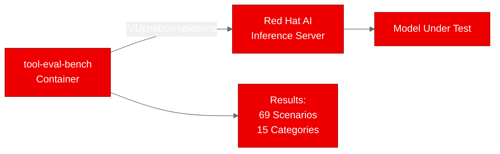

## What is tool-eval-bench?

If you're serving open-weight LLMs behind OpenAI-compatible endpoints, you've probably wondered: how well does this model actually handle tool calls? Not in theory, but in practice, when it needs to pick the right function from a dozen options, thread data through multi-step chains, or resist prompt injection attempts?

[tool-eval-bench](https://github.com/SeraphimSerapis/tool-eval-bench) answers that question with 69 deterministic scenarios across 15 categories: tool selection, parameter precision, multi-step chains, error recovery, safety boundaries, and more. It scores each result as pass, partial, or fail against concrete criteria, not vibes. It also bundles pluggable accuracy benchmarks (GSM8K, MMLU, IFEval) and throughput measurement through the same interface.

We deployed tool-eval-bench on Red Hat OpenShift AI to prove that Python evaluation tools can run as containerized batch workloads right next to the models they evaluate.

## Why tool-calling quality matters for enterprise AI

Agentic workflows live or die on tool-calling reliability. A model that hallucinates function parameters, calls the wrong tool, or ignores safety constraints isn't just inaccurate: it's dangerous in production. An agent that executes a database write when it should have done a read, or that follows a prompt injection to escalate privileges, creates real operational risk.

Most teams evaluate models on accuracy benchmarks before deploying them. But tool-calling quality is a separate axis that accuracy benchmarks don't cover. A model can score well on MMLU and still fail basic tool selection or parameter threading. If you're running agentic workloads on Red Hat OpenShift AI, you need both kinds of evaluation in your deployment pipeline.

## Containerizing for OpenShift with UBI

tool-eval-bench is a pure Python CLI tool with minimal dependencies: httpx, rich, and python-dotenv. No GPU required, no ML frameworks, no complex native libraries. That makes containerization straightforward, but the UBI Python image has a few quirks we had to work through.

The final Dockerfile:

```dockerfile
FROM registry.access.redhat.com/ubi9/python-312

WORKDIR /opt/app-root/src
USER 0

COPY . .
RUN chown -R 1001:0 /opt/app-root

USER 1001
RUN pip install --no-cache-dir .

USER 0
RUN chgrp -R 0 /opt/app-root && chmod -R g=u /opt/app-root

USER 1001
ENTRYPOINT ["tool-eval-bench"]
CMD ["--help"]
```

Three things we learned during the build:

1. **Copy everything before installing.** The `pyproject.toml` references `README.md` and expects the `src/` directory to exist. Copying only the manifest first and running `pip install .` fails because setuptools can't find the source tree.

2. **Fix ownership before pip install.** The UBI Python image's default user (1001) can't write to directories created by `COPY` (owned by root). Running `chown -R 1001:0` before switching to user 1001 resolves the permission issue.

3. **Don't use `--user` pip install.** The UBI Python image uses a virtualenv internally. The `--user` flag conflicts with virtualenv isolation and fails silently. Use the plain `pip install` within the image's virtualenv.

We built the image using OpenShift's binary build strategy, which uploads the local source to the cluster and builds on the build nodes. No local container runtime needed:

```bash
oc new-build --name=tool-eval-bench --binary --strategy=docker \
  --to-docker --to="quay.io/aicatalyst/tool-eval-bench:latest" \
  --push-secret=autopoc-registry-push

oc start-build tool-eval-bench --from-dir=. --follow --wait
```

## Deploying as batch evaluation Jobs

tool-eval-bench is a CLI tool, not a long-running server. Deploying it as a Kubernetes Deployment would cause CrashLoopBackOff because the process exits after running. The correct pattern is a Kubernetes Job: it runs, produces output, and terminates.

We created three Jobs, one per test scenario:

```yaml
apiVersion: batch/v1
kind: Job
metadata:
  name: tool-eval-bench-help
  namespace: poc-tool-eval-bench
spec:
  backoffLimit: 1
  activeDeadlineSeconds: 300
  template:
    spec:
      containers:
        - name: tool-eval-bench
          image: quay.io/aicatalyst/tool-eval-bench:latest
          command: ["tool-eval-bench"]
          args: ["--help"]
          resources:
            requests:
              memory: "256Mi"
              cpu: "250m"
          securityContext:
            allowPrivilegeEscalation: false
            capabilities:
              drop: ["ALL"]
      imagePullSecrets:
        - name: quay-pull
      restartPolicy: Never
```

All three jobs completed in under 5 seconds each.

## Test results and what they tell us

| Scenario | Status | Duration | What it validates |
|---|---|---|---|
| help-output | PASS | 0.19s | CLI installs correctly, all 50+ options registered |
| version-check | PASS | 0.17s | Package metadata intact, reports v2.0.6 |
| module-import | PASS | 0.17s | All 69 evaluation scenarios load without import errors |

These tests confirm the container is correctly built: dependencies resolve, the entry point works, and the evaluation framework initializes properly. The tool is ready to connect to a live inference endpoint for actual model benchmarking.



## Building automated model quality gates

The real value of containerizing tool-eval-bench isn't running it once. It's integrating it into your model deployment pipeline as an automated quality gate.

Here's the pattern:

1. **CronJob for continuous monitoring.** Convert the Job to a CronJob that runs nightly against your production inference endpoints. Store results in a PVC-backed SQLite database (tool-eval-bench has built-in persistence).

2. **Pipeline gate for model updates.** Before promoting a new model version, run the full 69-scenario benchmark. If Category K (Safety & Boundaries) scores below 50%, the tool automatically caps the rating, regardless of overall score. That's a meaningful safety gate.

3. **Multi-model comparison.** The tool includes a leaderboard feature (`--leaderboard`) and run diff (`--diff RUN_ID`) for comparing models side by side. Run the same benchmark against multiple serving backends and compare.

4. **Programmatic API.** For CI/CD integration, use the Python API directly:

```python
from tool_eval_bench.api import run_benchmark
import asyncio

result = asyncio.run(run_benchmark(
    model="Qwen/Qwen3-8B",
    base_url="http://inference-server:8000",
    backend="vllm",
))

assert result["final_score"] >= 75, "Model fails tool-calling quality gate"
```

## Try it yourself

The containerized tool-eval-bench is available at `quay.io/aicatalyst/tool-eval-bench:latest`. To run it against your own model serving endpoint on OpenShift AI:

```bash
kubectl run tool-eval-bench \
  --image=quay.io/aicatalyst/tool-eval-bench:latest \
  --restart=Never \
  --command -- tool-eval-bench \
  --base-url http://your-inference-server:8000 \
  --model your-model-name \
  --short --json
```

The `--short` flag runs the core 15 scenarios for a quick validation. Drop it for the full 69-scenario benchmark.

The full source, Dockerfile, and Kubernetes manifests are at [github.com/aicatalyst-team/tool-eval-bench](https://github.com/aicatalyst-team/tool-eval-bench).
