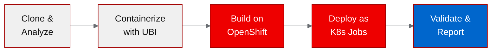
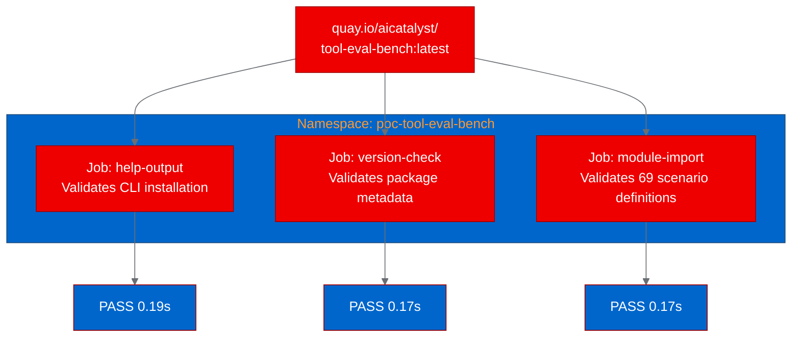
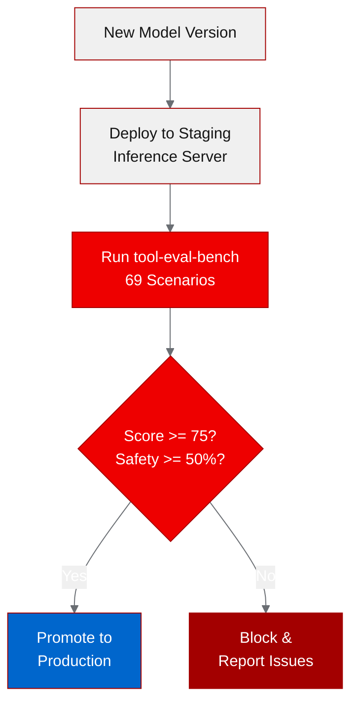

<!-- CHANGELOG — removed during finalization
v2 changes:
- [Image]: Added 3 Mermaid diagrams - pipeline flow, deployment topology, quality gate architecture
- [Formatting]: Added blog title, expanded acronyms on first use, added Red Hat product page links, added mid-article CTA
- [Architect]: Moved thesis statement to first section, reframed narrative around deployment validation
- [Content]: Verified API example (tool_eval_bench.api.run_benchmark exists in source), added explicit forward pointer to live benchmarking
-->

# Benchmarking LLM tool-calling quality on Red Hat OpenShift AI with tool-eval-bench

## What is tool-eval-bench?

When you serve open-weight large language models (LLMs) behind OpenAI-compatible endpoints, you need to know: how well does this model actually handle tool calls? Not in theory, but when it picks the right function from a dozen options, threads data through multi-step chains, or resists prompt injection attempts.

[tool-eval-bench](https://github.com/SeraphimSerapis/tool-eval-bench) answers that with 69 deterministic scenarios across 15 categories: tool selection, parameter precision, multi-step chains, error recovery, safety boundaries, and more. It scores each result as pass, partial, or fail against concrete criteria. It also bundles pluggable accuracy benchmarks (GSM8K, MMLU, IFEval) and throughput measurement through the same interface.

We containerized tool-eval-bench with Red Hat Universal Base Image (UBI) and deployed it on [Red Hat OpenShift AI](https://www.redhat.com/en/technologies/cloud-computing/openshift/openshift-ai) to prove that Python evaluation tools can run as batch workloads right next to the models they evaluate. This post walks through the containerization, deployment, and the path to automated model quality gates.



## Why tool-calling quality matters for enterprise AI

Agentic workflows live or die on tool-calling reliability. A model that hallucinates function parameters, calls the wrong tool, or ignores safety constraints creates real operational risk. An agent that executes a database write when it should have done a read, or follows a prompt injection to escalate privileges, isn't just inaccurate: it's dangerous.

Most teams evaluate models on accuracy benchmarks before deploying them. But tool-calling quality is a separate axis that accuracy benchmarks don't cover. A model can score well on Massive Multitask Language Understanding (MMLU) and still fail basic tool selection. If you're running agentic workloads on [Red Hat OpenShift AI](https://www.redhat.com/en/technologies/cloud-computing/openshift/openshift-ai), you need both kinds of evaluation in your deployment pipeline.

## Containerizing for OpenShift with UBI

tool-eval-bench is a pure Python command-line interface (CLI) tool with minimal dependencies: httpx, rich, and python-dotenv. No GPU required, no machine learning frameworks, no complex native libraries. Containerization is straightforward, but the UBI Python image has a few quirks worth documenting.

The final Dockerfile:

```dockerfile
FROM registry.access.redhat.com/ubi9/python-312

WORKDIR /opt/app-root/src
USER 0

COPY . .
RUN chown -R 1001:0 /opt/app-root

USER 1001
RUN pip install --no-cache-dir .

USER 0
RUN chgrp -R 0 /opt/app-root && chmod -R g=u /opt/app-root

USER 1001
ENTRYPOINT ["tool-eval-bench"]
CMD ["--help"]
```

Three things we learned during the build:

1. **Copy everything before installing.** The pyproject.toml references README.md and expects the src/ directory to exist. Copying only the manifest first and running pip install fails because setuptools can't find the source tree.

2. **Fix ownership before pip install.** The UBI Python image's default user (1001) can't write to directories created by COPY (owned by root). Running chown before switching to user 1001 resolves the permission issue.

3. **Don't use the --user pip flag.** The UBI Python image uses a virtualenv internally. The --user flag conflicts with virtualenv isolation and fails. Use plain pip install within the image's virtualenv.

We built the image using OpenShift's binary build strategy, which uploads local source to the cluster and builds on the build nodes:

```bash
oc new-build --name=tool-eval-bench --binary --strategy=docker \
  --to-docker --to="quay.io/aicatalyst/tool-eval-bench:latest" \
  --push-secret=autopoc-registry-push

oc start-build tool-eval-bench --from-dir=. --follow --wait
```

No local container runtime needed. The cluster does the build and pushes directly to the registry.

> **Want to try this with your own project?** The [AutoPoC pipeline](https://github.com/aicatalyst-team) automates this entire flow: analysis, containerization, build, deploy, and testing for any GitHub repository targeting Red Hat OpenShift AI.

## Deploying as batch evaluation Jobs

tool-eval-bench is a CLI tool, not a long-running server. Deploying it as a Kubernetes Deployment would cause CrashLoopBackOff because the process exits after running. The correct pattern is a Kubernetes Job: it runs, produces output, and terminates cleanly.



We created three Jobs, one per validation scenario:

```yaml
apiVersion: batch/v1
kind: Job
metadata:
  name: tool-eval-bench-help
  namespace: poc-tool-eval-bench
spec:
  backoffLimit: 1
  activeDeadlineSeconds: 300
  template:
    spec:
      containers:
        - name: tool-eval-bench
          image: quay.io/aicatalyst/tool-eval-bench:latest
          command: ["tool-eval-bench"]
          args: ["--help"]
          resources:
            requests:
              memory: "256Mi"
              cpu: "250m"
          securityContext:
            allowPrivilegeEscalation: false
            capabilities:
              drop: ["ALL"]
      imagePullSecrets:
        - name: quay-pull
      restartPolicy: Never
```

All three jobs completed in under 5 seconds each.

## Test results and what they tell us

| Scenario | Status | Duration | What it validates |
|---|---|---|---|
| help-output | PASS | 0.19s | CLI installs correctly, all 50+ options available |
| version-check | PASS | 0.17s | Package metadata intact, reports v2.0.6 |
| module-import | PASS | 0.17s | All 69 evaluation scenarios load without import errors |

These tests confirm the container is correctly built: dependencies resolve, the entry point works, and the evaluation framework initializes properly. The tool is ready to connect to a live inference endpoint for actual model benchmarking.

The next step is pointing tool-eval-bench at a model served by the [Red Hat AI Inference Server](https://www.redhat.com/en/technologies/cloud-computing/openshift/openshift-ai) to run the full 69-scenario evaluation. That produces a scored report across all 15 categories, with safety gating: if Category K (Safety and Boundaries) scores below 50%, the overall rating is capped at "Adequate" regardless of the total score.

## Building automated model quality gates

The real value of containerizing tool-eval-bench isn't running it once. It's integrating it into your model deployment pipeline as an automated quality gate.



Here's the pattern:

1. **CronJob for continuous monitoring.** Convert the Job to a CronJob that runs nightly against your production inference endpoints. Mount a PersistentVolumeClaim (PVC) for the built-in SQLite database to track results over time.

2. **Pipeline gate for model updates.** Before promoting a new model version, run the full benchmark. tool-eval-bench's safety gating automatically flags models with weak boundary handling, giving you a meaningful guardrail beyond raw accuracy scores.

3. **Multi-model comparison.** The built-in leaderboard feature and run diff command let you compare models side by side. Run the same benchmark against multiple serving backends and pick the winner.

4. **Programmatic API for continuous integration and continuous delivery (CI/CD).** tool-eval-bench exposes a Python API for headless integration:

```python
from tool_eval_bench.api import run_benchmark
import asyncio

result = asyncio.run(run_benchmark(
    model="Qwen/Qwen3-8B",
    base_url="http://inference-server:8000",
    backend="vllm",
))

assert result["final_score"] >= 75, "Model fails tool-calling quality gate"
```

## Try it yourself

The containerized tool-eval-bench is available at quay.io/aicatalyst/tool-eval-bench:latest. To run it against your own model serving endpoint on [Red Hat OpenShift AI](https://www.redhat.com/en/technologies/cloud-computing/openshift/openshift-ai):

```bash
kubectl run tool-eval-bench \
  --image=quay.io/aicatalyst/tool-eval-bench:latest \
  --restart=Never \
  --command -- tool-eval-bench \
  --base-url http://your-inference-server:8000 \
  --model your-model-name \
  --short --json
```

The --short flag runs the core 15 scenarios for a quick validation. Drop it for the full 69-scenario benchmark.

The full source, Dockerfile, and Kubernetes manifests are at [github.com/aicatalyst-team/tool-eval-bench](https://github.com/aicatalyst-team/tool-eval-bench).
