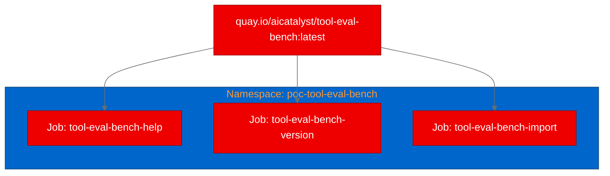

# PoC Report: tool-eval-bench

## Executive Summary

**tool-eval-bench** is a Python CLI benchmark that evaluates LLM tool-calling quality across 69 deterministic scenarios, targeting OpenAI-compatible serving stacks (vLLM, LiteLLM, llama.cpp). The PoC successfully containerized the tool using a UBI9 Python 3.12 base image, built and pushed the image to Quay.io via OpenShift binary builds, and deployed it as Kubernetes Jobs on OpenShift. All three validation scenarios passed, confirming the tool installs and runs correctly in a containerized environment.

## Project Analysis

- **Repository:** https://github.com/SeraphimSerapis/tool-eval-bench
- **Fork:** https://github.com/aicatalyst-team/tool-eval-bench
- **Description:** A tool-calling quality benchmark for evaluating LLM tool-use in agentic workflows. Runs 69 deterministic scenarios through OpenAI-compatible `/chat/completions` endpoints, scores results as pass/partial/fail, and produces detailed trace reports. Also includes pluggable accuracy benchmarks (GSM8K, MMLU, IFEval) and throughput measurement.
- **Classification:** llm-app (evaluation/benchmarking tool)

| Component | Language | Build System | ML Workload | Port |
|---|---|---|---|---|
| tool-eval-bench | Python 3.12 | pip (setuptools) | No | None (CLI) |

- **Key Technologies:** Python, httpx, rich, python-dotenv
- **License:** MIT

## PoC Objectives

1. Prove that tool-eval-bench can be containerized with UBI images and run on OpenShift
2. Validate that the CLI tool installs correctly and produces help output in a containerized environment
3. Demonstrate the benchmark can be packaged as a Kubernetes Job for batch evaluation workflows

## Pipeline Execution

- **Intake:** Single Python component identified with pip build system, no existing Dockerfile, GitHub Actions CI
- **Evaluate:** RHOAI fitness score 74/100. Strategy areas: agentic-ai, model-inference. Relationship: validates-platform-story
- **Fork:** Forked to https://github.com/aicatalyst-team/tool-eval-bench with AutoPoC topics
- **PoC Plan:** Classified as llm-app, Job deployment model, small resource profile, 3 CLI test scenarios
- **Containerize:** UBI9 Python 3.12 Dockerfile created. Required 3 build retries to resolve: (1) missing src/ directory during early pip install, (2) permission denied on egg-info, (3) --user flag incompatible with UBI virtualenv
- **Build:** Image built via OpenShift binary build and pushed to `quay.io/aicatalyst/tool-eval-bench:latest`
- **Deploy:** Three Kubernetes Job manifests generated with imagePullSecrets for Quay.io
- **Apply:** All three jobs completed successfully in 4 seconds each
- **Test:** All scenarios passed

## Test Results

| Scenario | Status | Duration | Details |
|---|---|---|---|
| help-output | ✅ PASS | 0.19s | CLI shows full usage with 50+ options across categories |
| version-check | ✅ PASS | 0.17s | Reports version 2.0.6 correctly |
| module-import | ✅ PASS | 0.17s | Successfully loads all 69 benchmark scenarios |

## Infrastructure Deployed

- **Namespace:** `poc-tool-eval-bench`
- **Container Image:** `quay.io/aicatalyst/tool-eval-bench:latest` (410MB)
- **Base Image:** `registry.access.redhat.com/ubi9/python-312`
- **Resources Created:**
  - 3 Kubernetes Jobs (one per test scenario)
  - 1 imagePullSecret for Quay.io
- **Resource Allocation:** 256Mi/250m requests, 512Mi/500m limits per job
- **GPU:** Not required
- **PVC:** None

## Recommendations

### Production Readiness
- **Container:** Production-ready. The UBI9 image builds cleanly and runs without issues.
- **Benchmarking:** Requires a live OpenAI-compatible LLM endpoint to run actual benchmarks. The PoC validated installation and CLI readiness.
- **Integration:** The tool's API module (`tool_eval_bench.api`) enables programmatic integration into CI/CD pipelines for automated model evaluation.

### Next Steps
1. **Connect to a live inference endpoint:** Deploy alongside a vLLM or Red Hat AI Inference Server instance to run the full 69-scenario benchmark
2. **CronJob scheduling:** Convert to a CronJob for periodic model quality monitoring
3. **Results persistence:** Mount a PVC for SQLite database and Markdown report storage across runs
4. **CI/CD integration:** Use the `run_benchmark()` API in a pipeline to gate model deployments on tool-calling quality scores

### Security Considerations
- Runs as non-root (UID 1001) with `allowPrivilegeEscalation: false` and all capabilities dropped
- No sensitive data stored in the container
- API keys for LLM endpoints should be injected via Kubernetes Secrets

### Scalability
- Each benchmark run is independent; multiple instances can run in parallel against different models
- Lightweight resource footprint (256Mi RAM) suitable for shared clusters

## Open Data Hub / OpenShift AI Considerations

- **Red Hat AI Inference Server:** tool-eval-bench can validate tool-calling quality of models served by the Red Hat AI Inference Server, providing a standardized quality gate before production deployment
- **Kubeflow Pipelines:** The benchmark can be integrated as a pipeline step for model validation workflows
- **Model Registry:** Benchmark results can inform model metadata in the model registry, tagging models with their tool-calling quality scores

## Appendix

### Artifacts
- **PoC Plan:** [poc-plan.md](https://github.com/aicatalyst-team/tool-eval-bench/blob/autopoc-artifacts/poc-plan.md)
- **Test Script:** [poc_test.py](https://github.com/aicatalyst-team/tool-eval-bench/blob/autopoc-artifacts/poc_test.py)
- **Dockerfile:** [Dockerfile.ubi](https://github.com/aicatalyst-team/tool-eval-bench/blob/main/Dockerfile.ubi)
- **K8s Manifests:** [kubernetes/](https://github.com/aicatalyst-team/tool-eval-bench/tree/main/kubernetes)
- **RHOAI Evaluation:** [.autopoc/rhoai-evaluation.md](https://github.com/aicatalyst-team/tool-eval-bench/blob/autopoc-artifacts/.autopoc/rhoai-evaluation.md)

### Build Issues Encountered
1. **Retry 1:** `pip install .` failed when only `pyproject.toml` was copied (missing `src/` and `README.md`)
2. **Retry 2:** Permission denied creating `src/tool_eval_bench.egg-info` - fixed by `chown -R 1001:0`
3. **Retry 3:** `--user` pip install incompatible with UBI Python virtualenv - fixed by removing `--user` flag

### Image Pull Configuration
- Quay.io repository is private; required `imagePullSecrets` in Job specs
- Pull secret created as `quay-pull` in the deployment namespace
